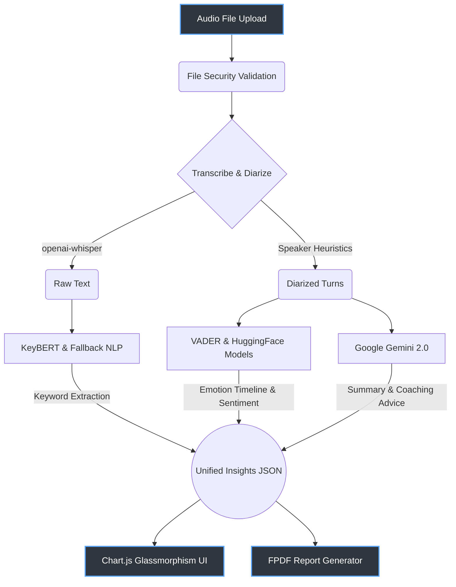

<div align="center">

# 🎧 Call Analyzer
**AI-Powered Audio Intelligence & Mentoring Guidance**

[](https://www.python.org/)
[](https://flask.palletsprojects.com/)
[](https://deepmind.google/technologies/gemini/)
[](https://github.com/openai/whisper)
[](https://opensource.org/licenses/MIT)

Transform your audio conversations into actionable insights with state-of-the-art AI transcription, multi-model sentiment analysis, and professional counselor analytics. 


</div>

<br/>

## ✨ Key Features

**🤖 Multi-Model AI Processing**
*   **OpenAI Whisper Integration:** Precise, state-of-the-art audio handling and transcription natively on-machine.
*   **Speaker Diarization:** Seamlessly separates individual speakers through pausing heuristics and context mapping.
*   **Google Gemini Analysis:** Dynamic contextual understanding, automated transcript summarizations, and conversational advice.
*   **BERT Topic Extraction & VADER Analysis:** Combined NLP strategies for robust sentiment breakdowns and high-relevance topic extraction.

**🎨 Modern Glassmorphism Interface**
*   **Responsive Dashboard:** Sleek, modern design built to operate beautifully on any device.
*   **Interactive Analytics:** Chart.js integration providing real-time sentiment distribution and temporal emotion tracking.
*   **Intelligent Theme Awareness:** Dynamic transitions between premium Light and Dark modes.

**🔒 Enterprise-Grade Application Design**
*   **PDF Report Generation:** One-click automated PDF reports with color-coded analytics and branded aesthetics.
*   **Strict Test Coverage:** Enforced Pytest CI logic paired with rigorous MyPy type formatting out of the box.

---

## 🧭 Architecture



---

## 🏗️ Technical Stack

| Category | Technologies Used | Description |
| :--- | :--- | :--- |
| **Backend Core** | `Python 3.12`, `Flask` | Primary scalable application server, REST routing. |
| **Speech Processing** | `openai-whisper` | Asynchronous local-first transcription architecture. |
| **NLP & Semantics** | `VADER`, `KeyBERT`, `Transformers` | Core NLP pipelines tracking emotion, valence, and keywords. |
| **Generative AI** | `google-generativeai` | High-end context mapping and mentorship generation logic. |
| **Frontend UI** | `Vanilla HTML/CSS/JS`, `Chart.js` | Zero-dependency core layout emphasizing fluid CSS3 animations. |
| **Reporting Tools** | `FPDF2` | Layout-driven programmatic PDF exporter for analysis sharing. |
| **CI / Quality** | `pytest`, `flake8`, `mypy` | End-to-end type hinting enforcement and behavioral verifications. |

---

## 🚀 Quick Start

### Prerequisites
*   Python 3.12+ installed
*   Google Gemini API Key
*   Minimum 4GB RAM (Whisper Model caching capability)

### Installation

```bash
# 1. Clone the repository
git clone https://github.com/C0deRatoR/call-analyzer.git
cd call-analyzer

# 2. Automatically setup virtual environment and dependencies
make setup
source venv/bin/activate

# 3. Export environment variables
export API_KEY="your_gemini_api_key_here"

# 4. Start the application
make run
```

Access the complete dashboard directly via: **`http://127.0.0.1:5000`**

---

## 🧪 Developer Commands
Call analyzer utilizes a strict built-in Makefile to streamline development:

*   `make setup`: Re-sync dependencies via `requirements.txt`.
*   `make test`: Run the full mocked PyTest logic on the ML pipeline.
*   `make lint`: Execute `flake8` compliance check and `mypy` strict layout analysis.
*   `make run`: Run the local development server cleanly.

For direct CLI execution skipping the frontend:
```bash
python src/main.py samples/demo.wav
```

---

## 📈 Technical Roadmap

**Phase 1: Core Processing Pipeline** ✅
- [x] Basic Audio transcription with Whisper
- [x] Contextual analysis with Gemini
- [x] Modern interactive UI framework deployed

**Phase 2: NLP Analytics Deep-Drive** ✅
- [x] Keyword extraction via KeyBERT & TF-IDF
- [x] Emotion tracking timeline using HuggingFace models
- [x] Full PDF Report Engine execution

**Phase 3: Production Polish & Scalability** 🔄
- [x] 100% Type-hint coverage and Linter implementation
- [x] Pytest suite injection
- [ ] User authentication / Enterprise roles
- [ ] Docker containerization integration
- [ ] Real-time WebSocket processing

---

## 🤝 Contributing
Open source thrives on community input. Check out our [Contributing Guidelines](CONTRIBUTING.md) to get involved. 

1. Fork the repo and create your branch (`git checkout -b feature/amazing-feature`)
2. Commit your code (`git commit -m 'feat: add amazing feature'`)
3. Pass tests (`make test && make lint`)
4. Open a Pull Request!

## 📄 License
This project is securely licensed under the MIT License - see the [LICENSE](LICENSE) file for deep details.

<div align="center">
<b>Built directly for actionable conversation insights</b> <br>
⭐ Star this repo if you find it beneficial!
</div>
